# Blackbox

**Blackbox is a local, offline-by-default time-travel debugger for AI agents.** It records a multi-step
model/tool run as an append-only, hash-chained trace, replays that trace fully offline from the saved cassette,
forks at a supported non-terminal step with a mutated prompt or injected tool result, and diffs the resulting
execution histories to find the first point where the two runs diverged — then verifies and self-checks the whole
loop.

It is *active debugging*, not passive observability: you don't just watch an agent run, you re-run it from a past
step under a changed condition and see exactly what changes.



## The core loop

```
record → replay → fork → mutate → continue → diff → verify → check
```

- **record** — run a scripted, multi-step tool-using agent and save an append-only, canonically-hashed trace.
- **replay** — re-derive the whole run offline from the cassette; no model or tool is ever called.
- **fork** — branch from a supported non-terminal step, copying the parent prefix byte-for-byte (metadata and
  terminal steps are not valid fork points).
- **mutate** — inject a different prompt or a different tool result at the fork point.
- **continue** — let the agent run on from the mutation with a deterministic model.
- **diff** — find and print the first step where parent and child diverge.
- **verify** — run one ordered hygiene pass over a cassette (schema, hash chain, provider neutrality, offline replay).
- **check** — run the whole loop end-to-end in one command and report a single PASS/FAIL.

Plus one CI utility outside the loop: **assert** — pin a committed cassette as a regression test (the `verify`
invariants + declared exact-match expectations on the replayed outcome) with a scriptable PASS/FAIL exit code.

## What it proves

- **Offline replay is a structural guarantee, not a convention.** `replayTrace(trace)` takes *only* a `Trace` — no
  model client, no tools — so it is impossible to make a live call from inside replay.
- **Fork prefixes are hash-identical.** A forked child shares a byte-for-byte, SHA-256-identical prefix with its
  parent up to the mutation point; the diff pinpoints the first divergence.
- **The full loop is proven against a real provider.** Opt-in, human-run proof scripts confirmed the complete
  `record → replay → fork → mutate → continue → diff` loop against the live Anthropic Messages API — without ever
  persisting a provider-native id, usage, stop metadata, or a key.
- **A committed corpus guards cassette compatibility.** A small, frozen, fake/offline v2 trace corpus with frozen
  hashes fails loudly if a future change would silently break cassette compatibility, hashing, replay, or fork
  geometry.

## Status

Blackbox is a **local, deterministic, offline-by-default** time-travel debugger. The full loop is complete,
hardened, composed under one self-check, proven live via opt-in scripts, and protected by a committed regression
corpus. **Cassette assertions** pin any committed cassette as a deterministic offline CI regression test, and an
**externally-shaped agent run** can be adapted into a first-class Blackbox cassette that verifies, replays, forks,
mutates, continues, and diffs fully offline.

- **What it is:** a local deterministic time-travel debugger for single-agent, tool-using runs — no UI, no backend,
  no live-by-default calls.
- **Trace format:** schema **v2** — tool rounds are recorded as structured, provider-neutral transcript parts
  (`MessagePart`) carrying a deterministic `toolCallId`. See [docs/03_trace_schema.md](docs/03_trace_schema.md).
- **Tests:** 583/583 passing, fully offline, zero live calls, no API key required.
- **Foreign cassettes are first-class:** an externally-shaped agent run, adapted into a Blackbox cassette, forks,
  mutates, continues, and diffs under the same unchanged semantics as a native trace.

See [DEMO.md](DEMO.md) for a full command-by-command walkthrough with expected output.

## What Blackbox is

- A **local, offline-by-default, deterministic** time-travel debugger for single-agent, tool-using runs.
- **Cassette record/replay** with a canonical SHA-256 hash chain.
- **Fork + mutate + diff** — branch from a supported non-terminal step, change one thing, see what diverges.
- **Offline verify + one-shot check** — hygiene and a full-loop smoke test with PASS/FAIL exit codes.
- **Cassette assertions** — pin a committed cassette as a deterministic offline CI regression test using exact-match
  expectations over the replayed outcome, fully offline.
- **Foreign-transcript ingest** — adapt a synthetic, external-style transcript into a first-class Blackbox v2
  cassette that verifies, replays, asserts, forks, and diffs fully offline (a dependency-free adapter-boundary proof,
  not a framework integration).
- A **committed fake/offline regression corpus** that freezes the loop's guarantees under version control.
- An **opt-in, human-run live proof** against Anthropic — run manually, never by the default CLI or `npm test`.

## What Blackbox is not

- **Not** a web UI, dashboard, backend, hosted service, or sharing platform.
- **Not** an observability / OpenTelemetry / metrics / log-aggregation platform.
- **Not** an agent framework or orchestrator (no LangChain, LlamaIndex, or MCP) — Blackbox does not run your agent
  for you; it records, replays, forks, and diffs recorded histories. It sits beside frameworks, not in place of them.
- **Not yet npm-published** — packaging is prepared and verified from a local tarball; publishing is a separate,
  explicit step. Not a production SDK.
- **Not** live-by-default: no CLI command and no test in `npm test` calls a real model or tool.

## Proof status

| Area | Status |
|---|---|
| Default loop (CLI + `npm test`) | **Fake / offline** — deterministic model clients (`FakeDeterministicModelClient` scripted + `ReactiveDemoModelClient` reactive fork/`check` continuation) + fixture tools; zero live calls; replay is structurally offline |
| Live provider proof | **Opt-in proof scripts only** — three human-run, key-gated scripts (`example:real-proof`, `example:real-tooluse-proof`, `example:real-fork-proof`); never in `npm test`, never CLI-wired; record real runs, replay offline. The full live `record → replay → fork → mutate → continue → diff` loop is proven (W4-E) |
| Regression corpus | **Committed** fake/offline v2 cassettes under `fixtures/traces/` with frozen hashes (W5-A) guarding cassette compatibility |
| UI / backend / dashboard / observability | **None, by design** — a discipline, not a TODO |

For the full real-vs-mocked breakdown, see the [What Is Real vs. Mocked](DEMO.md#what-is-real-vs-mocked) table in
DEMO.md.

## For reviewers

A curated 3–5 minute path that shows the whole value: the native loop, the CI-assertion utility, and the
foreign-origin cassette as a first-class citizen of the active debugging loop. It is a guided tour, **not** an
exhaustive command list (see [DEMO.md](DEMO.md) and the sections below for the rest).

One-time setup (the only step that touches the network — it installs dependencies from the npm registry; no build
step is needed to run the offline loop):

```sh
npm install
```

Then seven fully offline proof commands. Everything after `npm install` runs **local, deterministic, and
fake/offline** — zero live calls, no API key:

```sh
npm test -- --run                                                    # 583 tests, fully offline, zero live calls
npm run cli -- check                                                 # native one-shot: record → verify → fork → verify → diff → single PASS
npm run cli -- assert --trace fixtures/traces/success-tool-use.v2.json \
  --expect-status success --expect-tools search,calendar,booking     # pin a committed cassette as a CI regression gate (exit 0/1)
npm run cli -- verify --trace fixtures/external/chat-tool-use.converted.v2.json   # a foreign-origin cassette passes all four invariants
npm run cli -- fork --trace fixtures/external/chat-tool-use.converted.v2.json \
  --out traces/chat-tool-use-fork.json --mode tool-result \
  --fork-index 4 --mutation-step 3 \
  --payload-json '{"city":"Paris","temperature_c":-2,"condition":"Heavy snow"}'   # mutate the foreign cassette's past and continue offline
npm run cli -- diff --parent fixtures/external/chat-tool-use.converted.v2.json \
  --child traces/chat-tool-use-fork.json                             # first structural divergence + behavioral outcome verdict
npm run cli -- assert --trace traces/chat-tool-use-fork.json \
  --expect-status success --expect-tools get_weather                 # pin the forked child's behavior
```

What is real vs. fake here: the trace/replay/fork/diff/verify/assert machinery is the real product code.
Commands that invoke a model use only local deterministic fakes: `FakeDeterministicModelClient` on scripted paths
and `ReactiveDemoModelClient` for continuation; default CLI tools are fixture stubs. `verify`, `diff`, and `assert`
invoke neither models nor tools. The forked child `traces/chat-tool-use-fork.json` is a **generated, local,
git-ignored** artifact (always written via the explicit `--out` shown above). When `fork` continues the foreign
cassette, it invokes only the local deterministic fake model under the demo harness — **foreign tools are never
executed, and no live provider or network call occurs.**

## Worked example: debugging one bad answer

Here is one concrete bug, debugged end to end. The committed cassette
`fixtures/traces/success-tool-use.v2.json` records a run that ends in a confident booking. For this example, treat
the recorded run as buggy: the `search` tool result at step 3 was **wrong** — it reported availability that did not
exist, so the agent went on to book a phantom room. We want to see what the agent *should* have done once that one
tool result is corrected, without re-running anything live.

First, replay the recorded run to see the bad answer it produced — fully offline, straight from the cassette:

```sh
npm run cli -- replay --trace fixtures/traces/success-tool-use.v2.json
```

```
summary
Status:         success
Result:         Hotel booked for Alice on 2024-03-15 at 14:00.
```

The run "succeeded" — it confidently booked a room off a bad search result. Now fork at that recorded tool result
(step 3), inject the corrected **no-availability** result, and let the agent continue offline from there:

```sh
npm run cli -- fork --trace fixtures/traces/success-tool-use.v2.json \
  --out traces/case-study-fix.json \
  --mode tool-result \
  --fork-index 4 \
  --mutation-step 3 \
  --payload-json '{"results":[],"available":false,"message":"No hotels available for that date."}'
```

The child's continuation is *derived* from the injected result, not scripted: instead of booking, the corrected run
declines. Diff the recorded parent against the corrected child to pin exactly where — and how — they part:

```sh
npm run cli -- diff \
  --parent fixtures/traces/success-tool-use.v2.json \
  --child traces/case-study-fix.json
```

```
First divergence at index 3
  parent  tool result     a201c469  Tool result: search → ok
  child   tool result     bbf0f149  Tool result: search → ok
  changed value (result):
    parent: {"results":[{"title":"Fixture result A for \"weekend hotels\"","snippet":"First deterministic result."},{"title":"Fixture result B for \"weekend hotels\"","snippet":"Second deterministic result."}]}
    child:  {"results":[],"available":false,"message":"No hotels available for that date."}

Outcome:        same final status (success), but the final answer changed
  parent tools:  search → calendar → booking
  child tools:   search
```

The first divergence is exactly the tool result we changed (index 3); everything before it is hash-identical. The
behavioral `Outcome:` verdict spells out the consequence: the final answer changed, and the whole downstream tool
path collapsed from `search → calendar → booking` (it booked) to just `search` (it stopped). Finally, pin the
corrected behavior as a deterministic regression gate so this fix can't silently regress in CI:

```sh
npm run cli -- assert \
  --trace traces/case-study-fix.json \
  --expect-status success \
  --expect-final-answer 'Based on the search result, no options are available: "No hotels available for that date.". I could not complete the booking.' \
  --expect-tools search
```

```
◼ blackbox · assert
Trace:          traces/case-study-fix.json
Result:         ✓ PASS
...
expectations
  status               pass  success
  final_answer         pass  Based on the search result, no options are available: "No hotels available for that date.". I could not complete the booking.
  tools                pass  search
```

What is real vs. fake here: the record/replay/fork/diff/assert machinery — the canonical hash chain, the
hash-identical prefix, the first-divergence pin, the exact-match assertion — is the real product code, run over a
**committed cassette**. The model continuation is the **deterministic fake** (`ReactiveDemoModelClient`), tools are
**fixture stubs**, and **no live provider or network call occurs**. `traces/case-study-fix.json` is a **generated,
local, git-ignored** artifact (always written via the explicit `--out` above). This is a framing device over a
committed cassette — Blackbox does not find the bug for you; it lets you *reproduce, correct, and pin* a known bad
tool result offline and see precisely what changes.

## Quick Start

```sh
npm install            # one-time; installs dependencies from npm (the only networked step)
npm run cli -- check   # run the whole loop offline and print a single PASS — no API key
```

`check` records a run, verifies it, forks and mutates it, verifies the child, and diffs the two — the entire core
loop in one command. The [worked example](#worked-example-debugging-one-bad-answer) walks a single bug end to end,
and [DEMO.md](DEMO.md) is the full command-by-command tour.

## Run it as a packaged CLI

Blackbox is packaged as an installable CLI (bin name `blackbox`), but it is **not published to npm yet** — there is
no `npm install @ardaulas/blackbox` or `npx` from the registry. Packaging is **prepared and verified locally from a
tarball**; publishing is a separate, explicit step. To try the packaged command, build the tarball and install it
into a throwaway directory:

```sh
npm pack                                            # produces ardaulas-blackbox-<version>.tgz
cd "$(mktemp -d)" && npm init -y                     # a fresh throwaway project
npm install /absolute/path/to/ardaulas-blackbox-0.1.0.tgz
npx blackbox check                                   # the full offline loop, one PASS — no API key
```

The packaged `blackbox` runs the same offline commands as `npm run cli --` (`record`, `replay`, `fork`, `diff`,
`verify`, `assert`, `check`, `list`, `inspect`), with byte-identical output and the same `0`/`1` exit codes — it is
a thin launcher over the same source, no separate build. The `blackbox` command itself makes **no live model, tool,
or network call**. The one caveat is install-time, not run-time: `npm install <tarball>` may contact the npm registry
to fetch the CLI's own dependencies. There is no registry install and no registry `npx` — the tarball is produced and
installed locally.

## Use a cassette as a CI regression test

`assert` turns any committed cassette into a deterministic, fully offline PASS/FAIL check. It runs the four
`verify` invariants (schema, hash chain, provider neutrality, replayability) and then, for each expectation flag
you supply, does an exact-match check against the cassette's replayed terminal outcome and tool-call sequence. It
exits `0` only when verification and every declared expectation pass, and `1` otherwise — so it drops straight into
an npm script or a GitHub Actions step. No model, tool, or network call is made.

```sh
npm run cli -- assert \
  --trace fixtures/traces/success-tool-use.v2.json \
  --expect-status success \
  --expect-tools search,calendar,booking
```

Expectations are opt-in and exact (no fuzzy or semantic matching): `--expect-status <success|error|incomplete>`,
`--expect-final-answer <string>`, `--expect-failure-reason <string>`, and `--expect-tools <comma-separated>` (an
empty string asserts a final-answer-only run with no tool calls). With no expectation flags, `assert` runs the
invariants only. In GitHub Actions:

```yaml
- run: npm ci
- run: npm run cli -- assert --trace fixtures/traces/success-tool-use.v2.json --expect-status success --expect-tools search,calendar,booking
```

See [DEMO.md](DEMO.md) for annotated expected output and an explanation of each step.

## Adapt a foreign transcript

Blackbox records its own runs, but it can also **adapt an externally-shaped agent run** into a normal Blackbox v2
cassette and then verify/replay/assert it fully offline. This is a small **adapter-boundary proof**, not a framework
integration: a pure, dependency-free adapter (`src/ingest/foreignTranscript.ts`, `adaptForeignTranscript`) converts a
local, synthetic chat-style transcript fixture into a valid v2 trace. It is **not** official OpenAI, SDK, LangChain,
or MCP support, and there is no live ingestion — the input is a committed local fixture, and the conversion never
calls a model, tool, network, or clock.

The proof point is provider-neutrality by construction: the synthetic source
(`fixtures/external/chat-tool-use.foreign.json`) deliberately carries provider-like noise (token `usage`, a
`finish_reason`, a model name, message ids, and foreign tool-call ids like `call_a1B2c3`), and **none** of it crosses
into the converted cassette — foreign tool-call ids are remapped to Blackbox's deterministic `call-0` / `call-1`, and
every payload is built field-by-field. The committed converted cassette
(`fixtures/external/chat-tool-use.converted.v2.json`) is an ordinary cassette the existing commands consume unchanged:

```sh
npm run cli -- verify --trace fixtures/external/chat-tool-use.converted.v2.json
npm run cli -- replay --trace fixtures/external/chat-tool-use.converted.v2.json
npm run cli -- assert --trace fixtures/external/chat-tool-use.converted.v2.json --expect-status success --expect-tools get_weather,send_email
```

The adapter accepts exactly one tool call per assistant turn in a strict sequential `tool call → tool result` loop
ending in a final answer; parallel tool calls and error terminations are out of scope for this proof and are rejected
with a clear error.

The adapted cassette is also **not second-class in the active debugging loop**: it forks, mutates, continues, and
diffs with the same Blackbox semantics as a native trace. Inject a different `get_weather` result at step 3, fork at
step 4, and the deterministic offline continuation derives a new answer from the injected payload — then diff pins
the first divergence and the behavioral outcome change:

```sh
npm run cli -- fork \
  --trace fixtures/external/chat-tool-use.converted.v2.json \
  --out traces/chat-tool-use-fork.json \
  --mode tool-result --fork-index 4 --mutation-step 3 \
  --payload-json '{"city":"Paris","temperature_c":-2,"condition":"Heavy snow"}'
npm run cli -- verify --trace traces/chat-tool-use-fork.json
npm run cli -- diff --parent fixtures/external/chat-tool-use.converted.v2.json --child traces/chat-tool-use-fork.json
npm run cli -- assert --trace traces/chat-tool-use-fork.json --expect-status success --expect-tools get_weather
```

The forked child is a git-ignored local artifact under `traces/` (always pass the explicit `--out` shown above). The
child shares a hash-identical prefix with the committed parent before the mutation, and its answer visibly embeds the
injected weather payload — change the payload, change the answer. As everywhere in the default CLI, the continuation
is fake/offline: the CLI fork runs under the demo harness (the reactive deterministic fake model plus the fixture
tool executor). Foreign tools are never executed; the only model invocation is the local deterministic fake, and no
live provider or network call is made. This proves debuggability of the adapted cassette, not foreign tool
execution.

## Trace fixture corpus

`fixtures/traces/` holds a small **committed** set of deterministic, fake/offline v2 cassettes used as a
regression baseline (distinct from `traces/`, the git-ignored output of `record`/`fork`/`check`). Every fixture is
generated only from the fake model + fixture tools — no Anthropic/live/provider data — and is timestamp-normalized
so it is byte-reproducible.

Regenerate deliberately (only when a v2 change is intentional and audited):

```sh
npm run fixtures:generate            # check mode: verify the corpus is in sync (writes nothing)
npm run fixtures:generate -- --write # rewrite the corpus; then update the frozen hashes in tests/fixtures.test.ts
```

See `docs/20_week_five_a_plan.md` §7 for the regeneration policy.

---

## Documentation

- **[DEMO.md](DEMO.md)** — full command-by-command walkthrough with expected output.
- **[docs/03_trace_schema.md](docs/03_trace_schema.md)** — the v2 cassette format.
- **[docs/13_adapter_contract.md](docs/13_adapter_contract.md)** — the provider-neutral adapter boundary.
- **[docs/37_architecture_overview.md](docs/37_architecture_overview.md)** — how the engine fits together.

## Release history

Blackbox was built in small, tagged weekly milestones. The headline is **Status** above; this is a compact
milestone summary. Each row names its milestone tag, except `week-four-*`, which is a family of several Week-Four
tags rather than a single tag. The full, detailed build log lives in [docs/08_build_log.md](docs/08_build_log.md).

| Milestone (tag) | What it landed |
|---|---|
| `week-one-cli-proof` | Record → replay → fork (mutated prompt) → diff, hash-chained cassette |
| `week-two-core-hardening` | Schema versioning, tool-result mutation, fork-point semantics, richer demos |
| `week-three-cli-packaging` | Unified `cli` entry point (`record`/`replay`/`fork`/`diff`/`list`/`inspect`), output polish, DEMO |
| `week-four-*` (tag family) | Provider-neutral adapter boundary; opt-in live Anthropic proof of the full loop; structured v2 transcript; `verify`; one-shot `check` |
| `week-five-trace-fixture-corpus` | Committed fake/offline v2 regression corpus with frozen hashes |
| `week-five-public-demo-readiness` | README/DEMO re-authored as the repo front door (docs-only) |
| `week-six-diff-inspect-ergonomics` | Human-readable "changed value" divergence labels |
| `week-six-verify-replay-explanations` | Labelled `verify` FAIL explanations (secrets masked) |
| `week-six-release-freeze` | Docs verified against the real CLI (docs-only) |
| `week-seven-reactive-fake-model` | Continuation derives the child's answer from the mutated `tool_result` |
| `week-seven-behavioral-outcome-diff` | `Outcome:` verdict on `diff`/`fork` (status, answer, tool path) |
| `week-eight-terminal-polish` | One shared, color-gated terminal grammar across all commands |
| `week-eight-readme-hero` | Hand-authored SVG README hero rendering real `check` output |
| `week-nine-cassette-assert` | `assert` — pin a committed cassette as an offline CI regression gate |
| `week-ten-foreign-transcript-adapter` | Adapt an externally-shaped transcript into a v2 cassette |
| `week-eleven-foreign-fork-proof` | The adapted cassette forks, mutates, continues, and diffs under unchanged semantics |
| `week-twelve-reviewer-demo-path` | Curated reviewer walkthrough (docs-only) |
| `week-thirteen-worked-case-study` | The worked-example bug walkthrough above (docs-only) |
| `week-fourteen-package-readiness` | Local-tarball packaging as a `blackbox` CLI, verified offline — **not** npm-published |
